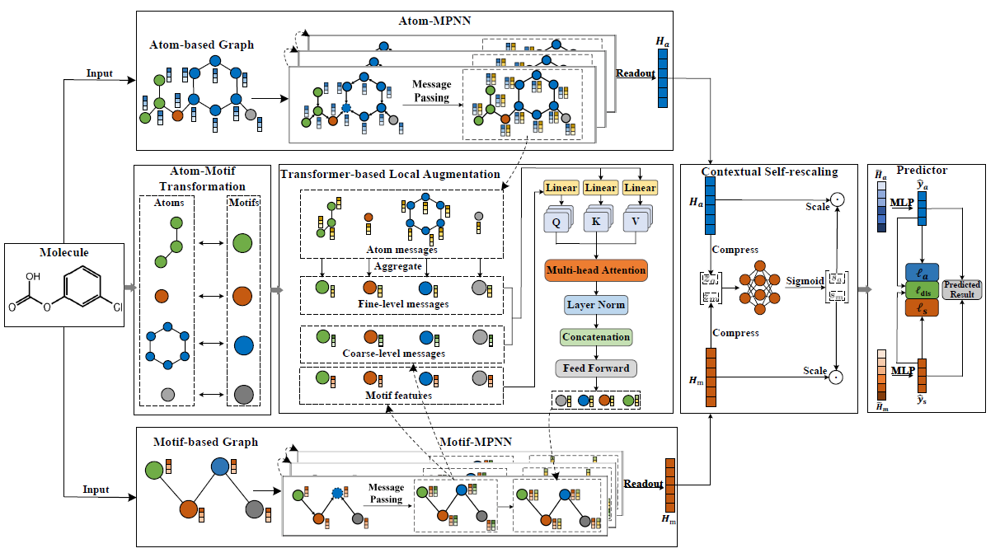

# HGNN
This is a Pytorch implementation of the paper:"HGNN:a novel hierarchical molecular  representations learning framework for property prediction"
## Overview of the Framework.
HGNN is a novel hierical molecular representation learning framework, consisting of Atom-MPNN and Motif-MPNN and adopts a local augmentation strategy to improve the performance of the downstream molecular property prediction tasks. Specifically, we perform MPNNs on the constructed motif-based graphs to capture the coarse grained structural information of molecules as a complement to fine-grained atom embeddings, and the message communication between atoms and motifs is enriched by introducing a novel Transformer-based local augmentation module.Additionally, we point out that current multi-representation learning methods may cause the weight difference issue and propose a simple yet effective rescaling module to extract interdependencies between hierarchical molecular representations.

<p align="center">
 
</p>

## Dependencies
+ cuda >= 9.0
+ cuDNN>=7.0
+ RDKit
+ torch >= 1.10.0

Setup the required environment using `hmpnn.yaml` with Anaconda. While in the project directory run:

    conda env create -f hmpnn.yaml

Activate the environment

    conda activate hmpnn
## Training
To train a model from scratch, run:

`python train_evaluate.py --dataset <datasetname> --num_folds 10 --device cuda:0 --epoch 150`

To train a model with optimized hyperparameters, run:
```linux
cd scripts
```
```linux
bash <datasetname>.sh
```

## The Prediction Results
Extensive experiments demonstrate that our HMPNN model obtains comparable performances against state-of-the-art baselines on 8 molecular property datasets.
- The classification datasets.

Model      | BBBP | SIDER | ClinTox | BACE | Tox21 
----       | ---|----       |----       |----        |----            
HMPNN|  0.928(0.027) | 0.642(0.023) | 0.917(0.030) | 0.856(0.034) | 0.807(0.017) 

- The regression datasets.

Model | FreeSolv | ESOL | Lipo 
----- | ---- | ---- | ---- 
HMPNN  | 1.921(0.474) | 0.870(0.154) |  0.632(0.016) 

We used a 10-folds validation with scaffold splitting, and reported the mean and standard deviation of AUC or RMSE values. For methodology and random-split results, please refer to the paper for more details.
